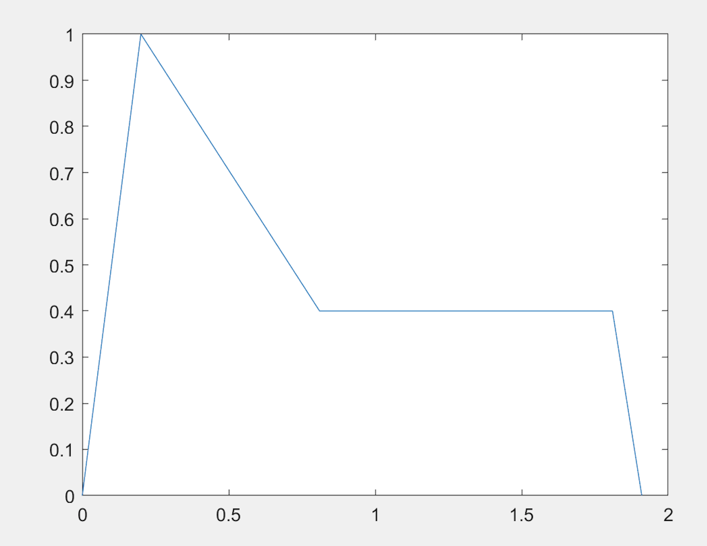
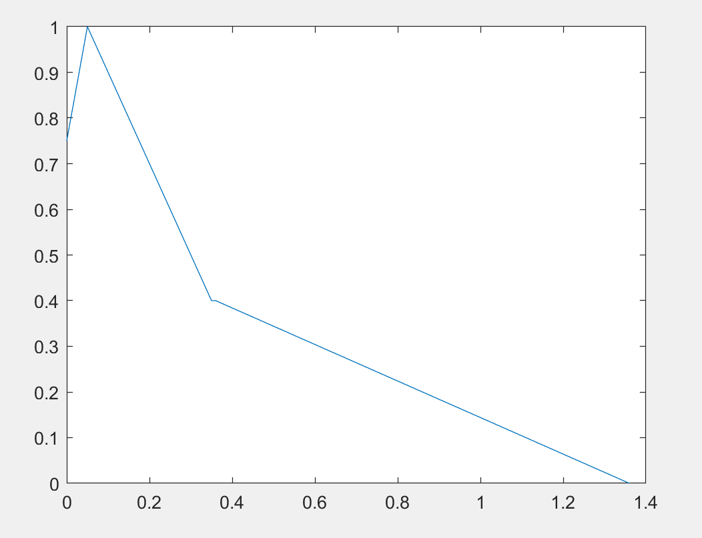
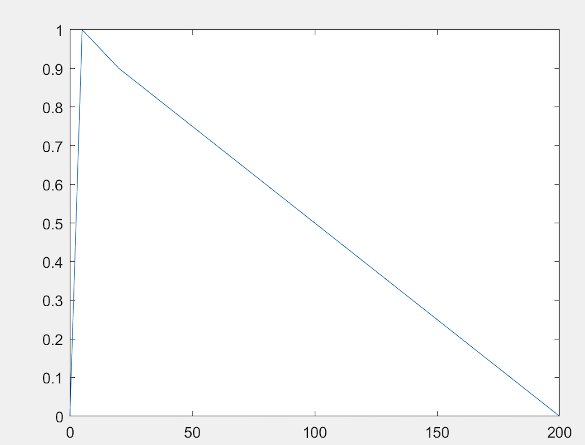
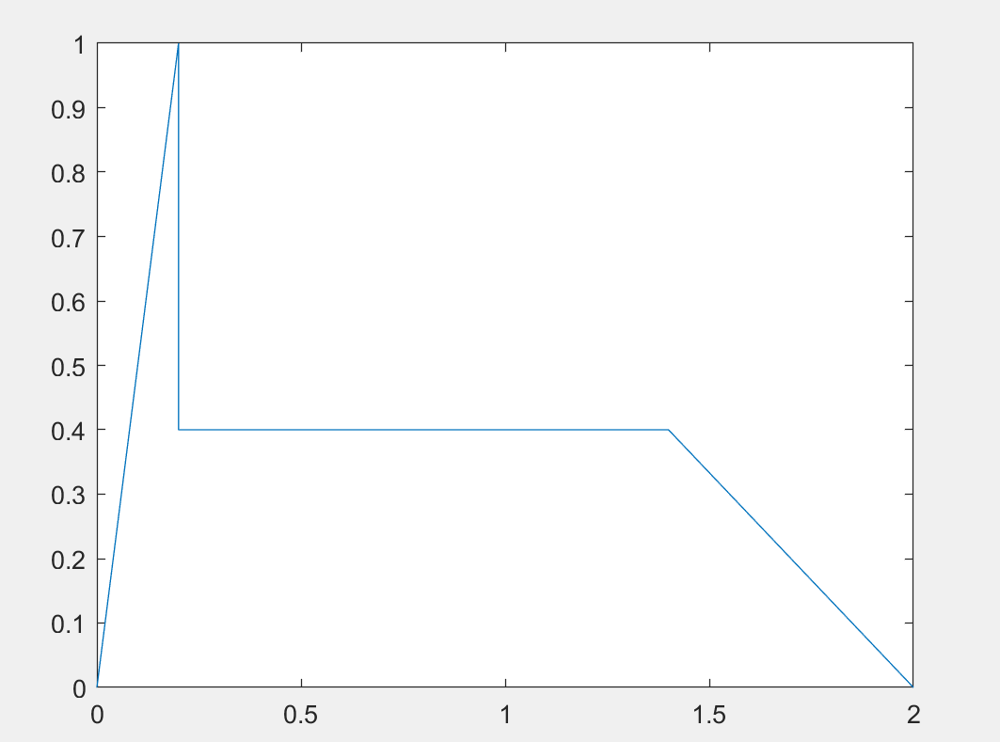
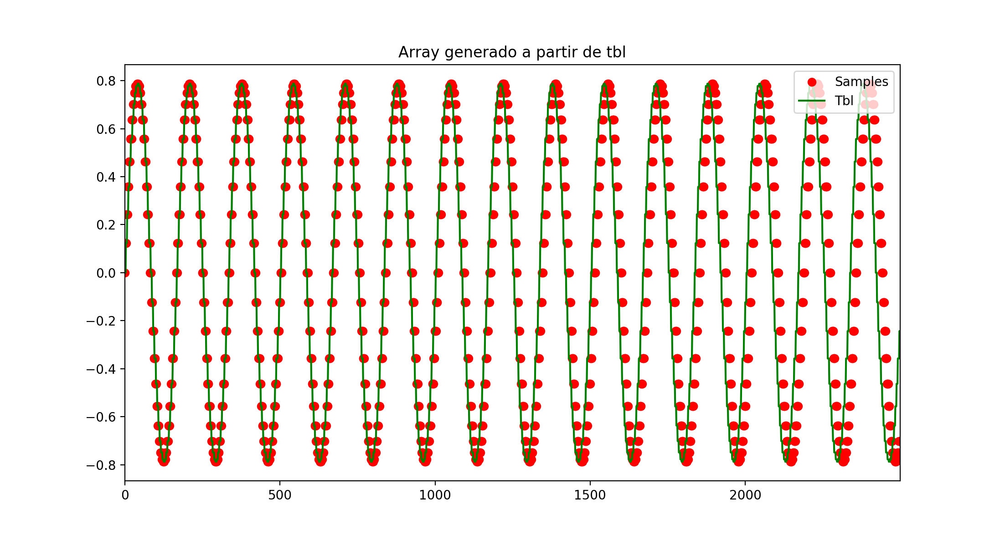
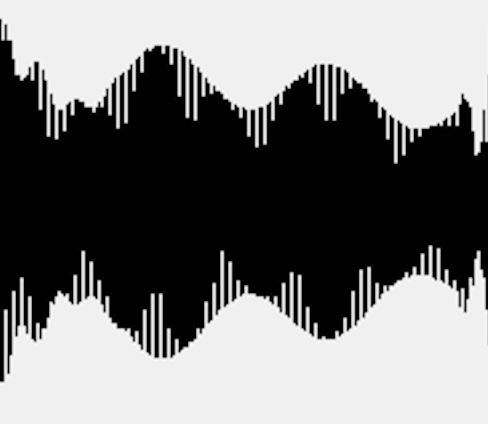
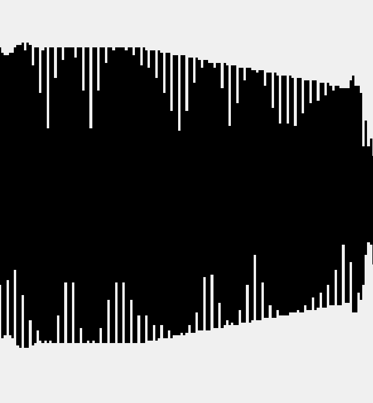

PAV - P5: síntesis musical polifónica
=====================================

Obtenga su copia del repositorio de la práctica accediendo a [Práctica 5](https://github.com/albino-pav/P5) y
pulsando sobre el botón `Fork` situado en la esquina superior derecha. A continuación, siga las instrucciones de la
[Práctica 3](https://github.com/albino-pav/P3) para crear una rama con el apellido de los integrantes del grupo de
prácticas, dar de alta al resto de integrantes como colaboradores del proyecto y crear la copias locales del
repositorio.

Como entrega deberá realizar un *pull request* con el contenido de su copia del repositorio. Recuerde que los
ficheros entregados deberán estar en condiciones de ser ejecutados con sólo ejecutar:

~~~~~~~~~~~~~~~~~~~~~~~~~~~~~~~~~~~~~~~~~~~~~~~~~~~~~.sh
  make release
~~~~~~~~~~~~~~~~~~~~~~~~~~~~~~~~~~~~~~~~~~~~~~~~~~~~~

A modo de memoria de la práctica, complete, en este mismo documento y usando el formato *markdown*, los ejercicios
indicados.

Ejercicios.
-----------

### Envolvente ADSR.

Tomando como modelo un instrumento sencillo (puede usar el InstrumentDumb), genere cuatro instrumentos que permitan
visualizar el funcionamiento de la curva ADSR.

* Un instrumento con una envolvente ADSR genérica, para el que se aprecie con claridad cada uno de sus parámetros:
  ataque (A), caída (D), mantenimiento (S) y liberación (R).
  
  Hemos usado un instrumento de la clase seno con unos valores iguales en todos los tiempos para obtener una curva más o meno intuitiva [ADSR_A=0.2; ADSR_D=0.2; ADSR_S=0.2; ADSR_R=0.2; N=40]: 
  
  
  
  En la curva se representa: 
    - ADSR_A:tiempo de ataque de 0 a 1.
    - ADSR_D:tiempo de bajada
    - ADSR_S:nivel de mantenimiento 
    - ADSR_R:tiempo de 
 
* Un instrumento *percusivo*, como una guitarra o un piano, en el que el sonido tenga un ataque rápido, no haya
  mantenimiemto y el sonido se apague lentamente. El ejemplo que hemos usado ha sido [ADSR_A=0.05; ADSR_D=0.3; ADSR_S=0.01; ADSR_R=1; N=40] inspirado en otros ejemplos que pueden encontrarse en el documento adjunto en el README.md proporcionado por el profesor
  
  - Para un instrumento de este tipo, tenemos dos situaciones posibles:
    * El intérprete mantiene la nota *pulsada* hasta su completa extinción.
    
     
    
    * El intérprete da por finalizada la nota antes de su completa extinción, iniciándose una disminución rápida del
      sonido hasta su finalización.
      
      
      

* Un instrumento *plano*, como los de cuerdas frotadas (violines y semejantes) o algunos de viento. En ellos, el
  ataque es relativamente rápido hasta alcanzar el nivel de mantenimiento (sin sobrecarga), y la liberación también
  es bastante rápida. Para representar un instrumento plano se han usado los valores [ADSR_A=0.2; ADSR_D=0; ADSR_S=1.2; ADSR_R=0.6; N=40;]
  
  

### Instrumentos Dumb y Seno.

Implemente el instrumento `Seno` tomando como modelo el `InstrumentDumb`. La señal **deberá** formarse mediante
búsqueda de los valores en una tabla.

- A continuación se adjunta el código del fichero `seno.cpp` con ambos métodos command y synthesize.

~~~~~~~~~~~~~~~~~~~~~~~~~~~~~~~~~~~~~~~~~~~~~~~~~~~~~.sh
#include <iostream>
#include <math.h>
#include "seno.h"
#include "keyvalue.h"

#include <stdlib.h>

using namespace upc;
using namespace std;

InstrumentSIN::InstrumentSIN(const std::string &param) 
  : adsr(SamplingRate, param) {
  bActive = false;
  x.resize(BSIZE);

  /*
    You can use the class keyvalue to parse "param" and configure your instrument.
    Take a Look at keyvalue.h    
  */
  KeyValue kv(param);
  int N;
FILE * f = fopen("tblfile.log","a");
  if (!kv.to_int("N",N))
    N = 40; //default value

  //Create a tbl with one period of a sinusoidal wave
  tbl.resize(N);
  float phase = 0, step = 2 * M_PI /(float) N;
  index = 0;
  for (int i=0; i < N ; ++i) {
    tbl[i] = sin(phase);
    phase += step;
  }
  fclose(f);
}

void InstrumentSIN::command(long cmd, long note, long vel) {

f0 = 440*pow(2,(note - 69.)/12);

  if (cmd == 9) {		//'Key' pressed: attack begins
    bActive = true;
    adsr.start();
    index = 0;
	a = 0;
	inc = ((f0 / SamplingRate) * tbl.size());
	A = vel / 127.;
	a = 0;
  }
  else if (cmd == 8) {	//'Key' released: sustain ends, release begins
    adsr.stop();
  }
  else if (cmd == 0) {	//Sound extinguished without waiting for release to end
    adsr.end();
  }
}

const vector<float> & InstrumentSIN::synthesize() {
  if (not adsr.active()) {
    x.assign(x.size(), 0);
    bActive = false;
    return x;
  }
  else if (not bActive)
    return x;
FILE * fp;
fp = fopen("xvector.log","a");

  for (unsigned int i=0; i<x.size(); ++i) {

	a = a + inc;
//Sin interpolación

	x[i] = A * tbl[round(a)];

//Con interpolación 
//x[i] =tbl[floor(a)]+(a-floor(a))*(tbl[floor(a+1)]-tbl[floor(a)])/(floor(a+1)-floor(a));

	 while(a >= tbl.size()) a = a - tbl.size();

  }
  adsr(x); //apply envelope to x and update internal status of ADSR
fclose(fp);
  return x;
}
~~~~~~~~~~~~~~~~~~~~~~~~~~~~~~~~~~~~~~~~~~~~~~~~~~~~~
- Explique qué método se ha seguido para asignar un valor a la señal a partir de los contenidos en la tabla, e incluya
  una gráfica en la que se vean claramente (use pelotitas en lugar de líneas) los valores de la tabla y los de la
  señal generada.
  
  Como bien se puede ver en el código y en el enunciado de la práctica asignamos a la frecuencia fundamental el siguiente valor : 
  ~~~~~~~~~~~~~~~~~~~~~~~~~~~~~~~~~~~~~~~~~~~~~~~~~~~~~.sh
  f0 = 440*pow(2,(note - 69.)/12);
  ~~~~~~~~~~~~~~~~~~~~~~~~~~~~~~~~~~~~~~~~~~~~~~~~~~~~~
  
 Por otro podemos recorrer a tabla que generamos a partir del seno de una fase determinada variando la velocidad.De esta forma se puede modificar la frecuencia del seno conseguir la fase que nos interese en función de f0.
  
  Al hacer un recorrido de la tabla obtenemos los siguientes valores: 
  
  

### Efectos sonoros.

- Incluya dos gráficas en las que se vean, claramente, el efecto del trémolo y el vibrato sobre una señal sinusoidal.
  Deberá explicar detalladamente cómo se manifiestan los parámetros del efecto (frecuencia e índice de modulación) en
  la señal generada (se valorará que la explicación esté contenida en las propias gráficas, sin necesidad de
  *literatura*).

- Fragmento de Tremolo.wav

  

- Fragmento de Vibrato.wav

  

  En ambos casos el efecto acústico percibido para el oyente no entrenado es muy similar. Pero si miramos las formas de onda con el wavesurfer de dos ficheros generados con dichos efectos por separado ( tremolo.wav y vibrato.wav ) podemos ver las diferencias que hay entre ellos. 

  El tremolo se caracteriza a nivel de onda por una variación significativa de la amplitud. Por otro lado el vibrato se caracteriza por una variación de la frecuencia.

### Síntesis FM.

Construya un instrumento basado en síntesis FM, siguiendo las explicaciones contenidas en el enunciado y el artículo
de [John M. Chowning](https://ccrma.stanford.edu/sites/default/files/user/jc/fm_synthesispaper-2.pdf). El instrumento
usará como parámetros **básicos** los números `N1` y `N2`, y el índice de modulación `I`, que deberá venir expresado
en semitonos.

- Use el instrumento para generar un vibrato de *parámetros razonables* e incluya una gráfica en la que se vea,
  claramente, la correspondencia entre los valores `N1`, `N2` e `I` con la señal obtenida.
- Use el instrumento para generar un sonido tipo clarinete y otro tipo campana. Tome los parámetros del sonido (N1,
  N2 e I) y de la envolvente ADSR del citado artículo. Con estos sonidos, genere sendas escalas diatónicas (fichero
  `doremi.sco`) y ponga el resultado en los ficheros `work/doremi/clarinete.wav` y `work/doremi/campana.work`.
  * También puede colgar en el directorio work/doremi otras escalas usando sonidos *interesantes*. Por ejemplo,
    violines, pianos, percusiones, espadas láser de la [Guerra de las Galaxias](https://www.starwars.com/), etc.

### Orquestación usando el programa synth.

Use el programa `synth` para generar canciones a partir de su partitura MIDI. Como mínimo, deberá incluir la
*orquestación* de la canción *You've got a friend in me* (fichero `ToyStory_A_Friend_in_me.sco`) del genial
[Randy Newman](https://open.spotify.com/artist/3HQyFCFFfJO3KKBlUfZsyW/about).

- En este (lamentable) arreglo, la pista 1 corresponde al instrumento solista (puede ser un piano, flautas, violines,
  etc.), y la 2 al bajo (bajo eléctrico, contrabajo, tuba, etc.).
- Coloque el resultado, junto con los ficheros necesarios para generarlo, en el directorio `work/music`.
- Indique, a continuación, la orden necesaria para generar la señal (suponiendo que todos los archivos necesarios
  están en direcotorio indicado).

  - En el directorio work se ejecuta la siguiente línea, generando el fichero ToyStory_A_Friend_in_me.wav
~~~~~~~~~~~~~~~~~~~~~~~~~~~~~~~~~~~~~~~~~~~~~~~~~~~~~.sh
  synth dumb.orc /Users/victorestrada/Desktop/PAV/P5/samples/ToyStory_A_Friend_in_me.sco ToyStory_A_Friend_in_me.wav
~~~~~~~~~~~~~~~~~~~~~~~~~~~~~~~~~~~~~~~~~~~~~~~~~~~~~

También puede orquestar otros temas más complejos, como la banda sonora de *Hawaii5-0* o el villacinco de John
Lennon *Happy Xmas (War Is Over)* (fichero `The_Christmas_Song_Lennon.sco`), o cualquier otra canción de su agrado
o composición. Se valorará la riqueza instrumental, su modelado y el resultado final.
- Coloque los ficheros generados, junto a sus ficheros `score`, `instruments` y `efffects`, en el directorio
  `work/music`.
- Indique, a continuación, la orden necesaria para generar cada una de las señales usando los distintos ficheros.